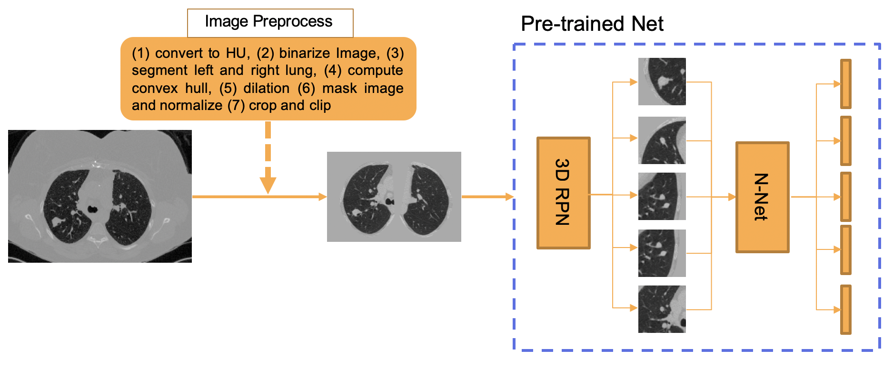
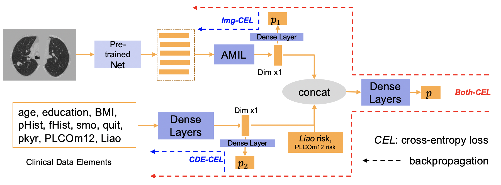

# DeepLungScreening Overview

This is the Deep Learning Open-source Lung cancer risk estimation repository, with PyTorch implementations. We prevoide source code, running tutorial, pre-trained model, docker, and [example image](https://drive.google.com/drive/folders/1gyKfWa_vmI_0K0dZ_lBUynCnOJhy3dKU?usp=sharing) in this repository.

Please see the requirement in the Dockerfile. Different version packages should be easy to adapt (not guarantee). 

# Tutorial

All the steps can be find in run_all.sh. A INPUTS and OUTPUTS example can be found here. 



<p align="center"> Fig. 1. Step 1-3 are summarized in this Figure </p>


## step 1: image pre-process

> python3 ./1_preprocess/step1_main.py --sess_csv ${SPLIT_CSV} --prep_root ${PREP_ROOT} --ori_root ${ORI_ROOT} 

```${SPLIT_CSV}``` is the csv file stores the scan list (and meta data) you want to test. 
```${PREP_ROOT}``` is the data folder saves the pre-processed result.
```${ORI_ROOT}``` is the data folder stores the scans you want to test.

## step 2: nodule detection

> python3 ./2_nodule_detection/step2_main.py --sess_csv ${SPLIT_CSV} --bbox_root ${BBOX_ROOT} --prep_root ${PREP_ROOT} 

```${BBOX_ROOT}``` is the data folder stores the nodule detection results.


## step 3: feature extraction

> python3 ./3_feature_extraction/step3_main.py --sess_csv ${SPLIT_CSV} --bbox_root ${BBOX_ROOT} --prep_root ${PREP_ROOT} --feat_root ${FEAT_ROOT}

```${FEAT_ROOT}``` is the data folder stores the image feature results.


<p align="center"> Fig. 2. Step 4 are summarized in this Figure</p>

## step 4: co-learning of meta data and image

> python3 ./4_co_learning/step4_main.py --sess_csv ${SPLIT_CSV} --feat_root ${FEAT_ROOT} --save_csv_path ${PRED_CSV}

```${PRED_CSV}``` is the predicted result from deep learning method.

# Docker

The Dockerfile is shared in this repository. The docker image rg15/deeplung:0.3 can be downloaded from DockHub. 

